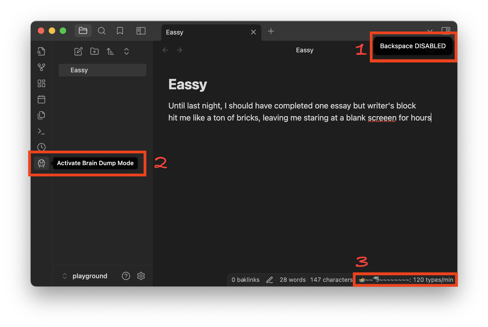

# Brain Dump Mode 🤯

1. We kindly **DISABLE your delete key** to help you focus on COMPLETING your first draft. We call it the 'Brain Dump Mode' 🤯
2. You can activate 'Brain Dump Mode' with sidebar train icon 🚅
3. Shark 🦈 will chase you 🏊 if your typing speed is too slow 🩸

## Description

**Done is better than perfect.** Brain Dump Mode helps you complete your first messy draft without the temptation to edit. Once activated, your delete key will be DISABLED, forcing you to keep writing and just burn your keyboards 🔥.

## Features

- **Disable Delete Key:** Prevents the use of the Backspace and Delete keys to encourage continuous writing.
- **Shark Mode:** A shark will chase you if you type too slowly, motivating you to keep writing.

## Use Cases

- **First Drafts:** Perfect for writers who struggle with perfectionism and need to get their initial ideas down.
- **Brainstorming:** Ideal for brainstorming sessions where the goal is to generate ideas without self-censorship.
- **Overcoming Writer's Block:** Helps overcome writer's block by removing the option to delete and forcing forward momentum.

## Installation

1. Download and install the plugin.
2. Activate Brain Dump Mode from the settings.
3. Start writing without the ability to delete!
